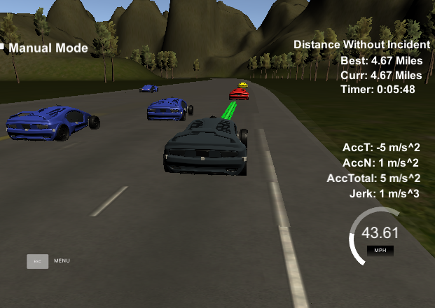

# Overview
This repository contains the code needed to build a path planner that creates smooth, safe trajectories for the car to follow. The highway track has other vehicles, all going different speeds, but approximately obeying the 50 MPH speed limit. The path planner is able to keep inside its lane, avoid hitting other cars, and pass slower moving traffic all by using localization, sensor fusion, and map data.

The project was created with the Udacity [Starter Code](https://github.com/udacity/CarND-Path-Planning-Project).
It involves the Term 2 Simulator which can be downloaded [here](https://github.com/udacity/self-driving-car-sim/releases/tag/T3_v1.2).

## Content of this repo
- `scr` is the directory with the project code.
```
root
|   
|___src
    |   Eigen-3.3
    |   helpers.h
    |   json.hpp
    |   main.cpp
    |   spline.h
```
  - `main.cpp` -  This file contains the code that will actually be running the path planner and calling the associated methods.
  - `helpers.cpp` - contains some helper functions like the`getXY` fuction, which takes in Frenet (s,d) coordinates and transforms them to (x,y) coordinates.
  - `spline.h`- A really helpful resource for doing this project and creating smooth trajectories was using http://kluge.in-chemnitz.de/opensource/spline/, the spline function is in a single hearder file is really easy to use.initializes the particle filter, performs particle predictions, updates weights and resamples the particles.

## Introduction
The goal of this project is to navigate a car around a simulated highway scenario, including traffic and given waypoint, telemetry, and sensor fusion data. The car must not violate a set of motion constraints, namely maximum velocity, maximum acceleration, and maximum jerk, while also avoiding collisions with other vehicles, keeping to within a highway lane (aside from short periods of time while changing lanes), and changing lanes when doing so is necessary to maintain a speed near the posted speed limit.

## Implementation

### 1. Construct Interpolated Waypoints of Nearby Area 

The track waypoints given in the `highway_map.csv` file are spaced roughly 30 meters apart, so the first step in the process is to interpolate a set of nearby map waypoints (in the current implementation, five waypoints ahead of and five waypoints behind the ego vehicle are used) and produce a set of much more tightly spaced (0.5 meters apart) waypoints which help to produce more accurate results from the `getXY` and `getFrenet` methods and also account for the discontinuity in `s` values at the end/beginning of the track.

### 2. Determine Ego Car Parameters

The simulator returns instantaneous telemetry data for the ego vehicle, but it also returns the list of points from previously generated path. This is used to project the car's state into the future and a "planning state" is determined based on the difference between points at some prescribed number of points along the previous path. In effect, this can help to generate smoother transitions, handle latency from transmission between the controller and the simulator, and alleviate the trajectory generator of some computation overhead.

### 3. Generate Predictions from Sensor Fusion Data

The sensor fusion data received from the simulator in each iteration is parsed and trajectories for each of the other cars on the road are generated.

### 4. Determine Best Trajectory

Using the ego car "planning state" and sensor fusion predictions an optimal trajectory is produced. 

1. Available states are updated based on the ego car's current position, with some extra assistance from immediate sensor fusion data . 
2. Each available state is given a target Frenet state (lane position and velocity, and acceleration ) based on the current state and the traffic predictions. 
3. A jerk-minimizing (JMT) trajectory is produced for each available state and target  using the `spline.h` library).

### 5. Produce New Path

The new path starts with a certain number of points from the previous path, which is received from the simulator at each iteration. From there a spline is generated beginning with the last two points of the previous path that have been kept (or the current position, heading, and velocity if no current path exists), and ending with two points 30 and 60 meters ahead and in the target lane. This produces a smooth x and y trajectory. To prevent excessive acceleration and jerk, the velocity is only allowed increment or decrement by a small amount, and the corresponding next x and y points are calculated along the x and y splines created earlier. 


The code in main.cpp is based on the [Starter Code](https://github.com/udacity/CarND-Path-Planning-Project).

The code consist of three parts:

### Prediction
This part of the code deals with the telemetry and sensor fusion data. The code identifies (1) Is there a car in front of us?  (2) Is there a car to the right, preventing a lane change?  (3) Is there a car to the left , preventing a lane change?

A car is considered "present" when its distance is less than 30 meters in front or behind.

### Behavior
Based on the prediction of the situation above, the code increases speed, decreases speed, or makes a lane change when it is safe. A `speed_diff` is created to be used for speed changes when generating the trajectory in the last part of the code. This approach makes the car more responsive, acting faster to changing situations.

### Trajectory
This code does the calculation of the trajectory based on the speed and lane output from the behavior, car coordinates and past path points.

The last two points of the previous trajectory (or the car position if there are no previous trajectory, lines) are used in conjunction with three points at a far distance to initialize the spline calculation. Next the coordinates are transformed (shift and rotation) to local car coordinates.

The pass trajectory points are then copied to the new trajectory. The rest of the points are calculated by evaluating the spline and transforming the output coordinates to not local coordinates.

## Conclusion

The resulting path planner works reasonably and satisfies the requirements in the project rubric. 

## Results
Here is a screenshot from the simulator with the car at 4.67 miles.



## References
The code in this project was adapted from the Path Planning course, which was part of Udacity's Self-Driving Car Nanodegree program.